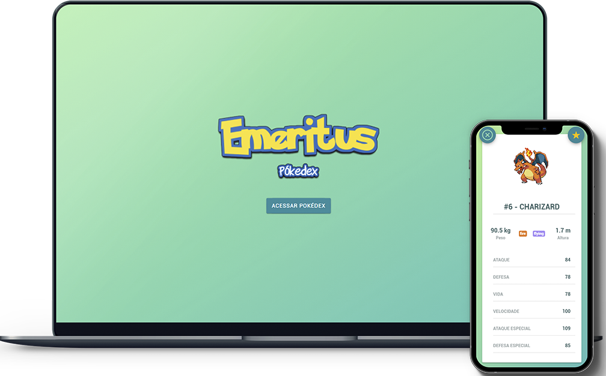

<h1 align="center">
    
</h1>

<p align="center">
  <a href="#-tecnologias">Tecnologias</a>&nbsp;&nbsp;&nbsp;|&nbsp;&nbsp;&nbsp;
  <a href="#-projeto">Projeto</a>&nbsp;&nbsp;&nbsp;|&nbsp;&nbsp;&nbsp;
  <a href="#-instalação">Instalação</a>&nbsp;&nbsp;&nbsp;|&nbsp;&nbsp;&nbsp;
  <a href="#-layout">Layout</a>&nbsp;&nbsp;&nbsp;|&nbsp;&nbsp;&nbsp;
  <a href="#memo-licença">Licença</a>
</p>

<br>

<p align="center">
  
</p>

## 🚀 Tecnologias

Esse projeto foi desenvolvido com as seguintes tecnologias:

- [Angular](https://angular.io)
- [TypeScript](https://www.typescriptlang.org/)
- [Ionic](https://ionicframework.com)
- [Capacitor](https://capacitorjs.com)
- [Sass](https://sass-lang.com/documentation/syntax)
- [Firebase (em implementação no projeto)](https://firebase.google.com)

Nesse projeto foram utilizadas as seguintes integrações:
- [PokéAPI](https://pokeapi.co)

## 💻 Projeto
O aplicativo foi desenvolvido em teste de emprego para a empresa Venturus, tendo como requisitos desenvolver uma aplicação utilizando do framework Angular/Angular JS e realizando os requisitos exigidos alimentando a aplicação com a api pública [PokéAPI](https://pokeapi.co)

- [Versão Demo Web (Em breve)]
- [Versão Demo Mobile (Em breve)]

## 🔧 Instalação

Para executar o projeto em sua máquina/dispostivo, serão necessários os seguintes recursos instalados:

- [Node.js](https://nodejs.org/en/)
- [Yarn (Opcional)](https://yarnpkg.com)
- [Ionic CLI (instalação por linha de comando)](https://ionicframework.com/docs/intro/cli)
- [Android Studio](https://developer.android.com/studio)
- [Xcode (somente para usuários macOS e que irão compilar para dispositivos iOS)](https://developer.apple.com/xcode/)

Para realizar uma cópia deste projeto em sua máquina utilize o seguinte comando na pasta desejada atráves do prompt/terminal de comando do seu sistema:

```git clone https://github.com/Emeritvs/pokedex.git```

Antes de instalar as dependências do projeto, será necessário executar o seguinte comando em seu prompt/terminal para instalar o Ionic CLI (necesário ter instalado o [Node](https://nodejs.org/en/) anteriormente) :

```npm install -g @ionic/cli```

Com o [Node](https://nodejs.org/en/) instalado anteriormente acesse a pasta com os arquivos clonados do repositório e execute o seguinte comando:

```npm install```

Para executar a versão web do projeto em sua máquina execute o seguinte comando:

```ionic serve```

Para realizar a compilação para um dispositivo móvel em forma de app, serão necessários os seguintes comandos:

```ionic cap add android```

Comando necessário para gerar a pasta onde serão guardados os arquivos do projeto convertidos para Android;

```ionic cap add ios```

Comando necessário para gerar a pasta onde serão guardados os arquivos do projeto convertidos para iOS (somente para usuários macOS e que irão compilar o projeto num dispositivo iOS pelo [Xcode](https://developer.apple.com/xcode/));

```ionic build```

Para que seja executada a conversão dos códigos TypeScript do projeto para JavaScript ES2015 (otimização para o mobile);

```npx jetifier```

Execute esse comando sempre que instalar um novo plugin pelo comando ```npm install```, ele  irá otimizar os plugins instalados do [Capacitor](https://capacitorjs.com) e convertê-los para Android X caso o seu projeto mobile utilize essa versão;

```ionic cap sync```

Execute esse comando para sincronizar e atualizar plugins adicionados ao projeto, os plugins podem ser encontrados em [Capacitor](https://capacitorjs.com);

```ionic cap copy```

Sempre que adicionar um novo comando é necessário executar este comando para que o mesmo seja implementado nas pastas onde são gerados os arquivos para o mobile, senão o plugin será somente instalado nos arquivos principais do projeto (parte web);

Após realizar os comandos anteriores, para compilar o projeto e gerar uma versão app dele será necessário o seguinte comando:
 
Para instalar em um dispositivo Android:  ```ionic cap open android``` 

ou

Para instalar em um dispositivo iOS (requer estar em uma máquina com macOS e [Xcode](https://developer.apple.com/xcode/)):  ```ionic cap open ios``` 

Após abrir o programa de compilação recomendo seguir estes tutoriais para cada programa:

-Android Studio (Dispositivos Android): https://developer.android.com/training/basics/firstapp/running-app

-Xcode (Dispositivos iOS): https://codewithchris.com/deploy-your-app-on-an-iphone/

Ao executar os tutoriais acima, o projeto será instalado como um app no dispositivo do qual você conectou em sua máquina via USB.

## 🔖 Layout

Nos links abaixo você encontra o layout do projeto web. Lembrando que você precisa ter uma conta no [Adobe](https://www.adobe.com) para acessá-lo.

- [Layout Web (Em breve)]


## :memo: Licença

Esse projeto está sob a licença MIT. Veja o arquivo [LICENSE](LICENSE.md) para mais detalhes.

---

Projeto desenvolvido por Guilherme Gomes (Emeritvs) em teste para a [Venturus](https://venturus.org.br) :wave:
